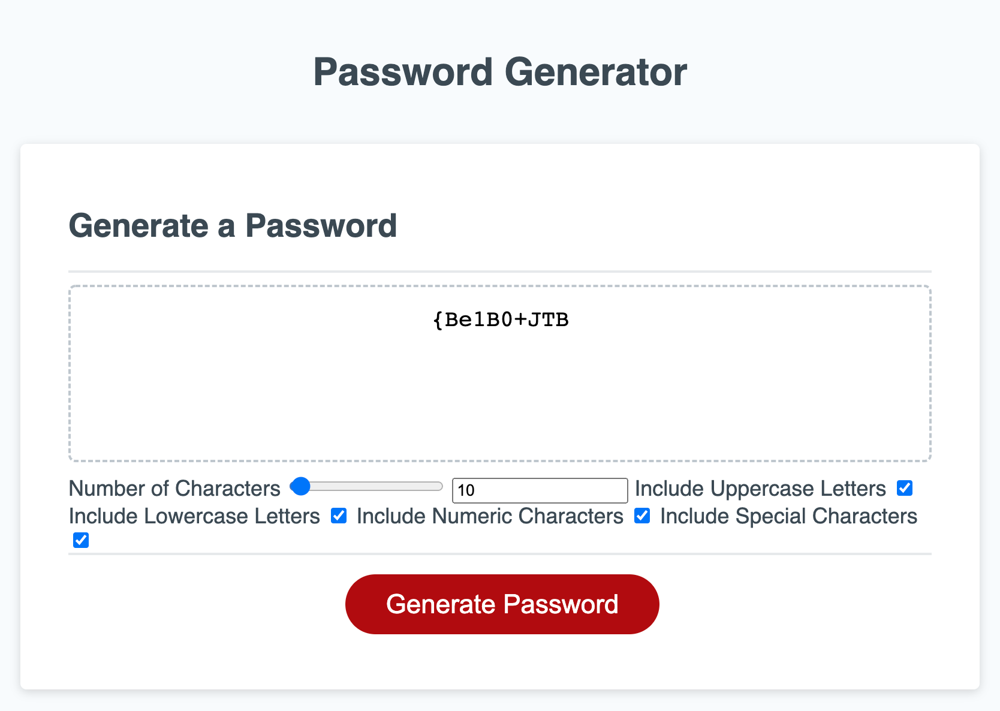

# Password Generator

https://robertrish.github.io/password-generator/

## Table of Contents

1. [Title](#title)
2. [Description](#description)
3. [Screenshots](#screenshots)
4. [License](#license)
5. [Questions](#questions)

## Description

Generates random, cryptic passwords with settings to specify how many characters you would like and whether to include/disclude uppercase letters, lowercase letters, and numeric/special characters.

## Screenshots

## License

        MIT License

        Copyright (c) [2022] [Robert Rish]

        Permission is hereby granted, free of charge, to any person obtaining a copy
        of this software and associated documentation files (the "Software"), to deal
        in the Software without restriction, including without limitation the rights
        to use, copy, modify, merge, publish, distribute, sublicense, and/or sell
        copies of the Software, and to permit persons to whom the Software is
        furnished to do so, subject to the following conditions:

        The above copyright notice and this permission notice shall be included in all
        copies or substantial portions of the Software.

        THE SOFTWARE IS PROVIDED "AS IS", WITHOUT WARRANTY OF ANY KIND, EXPRESS OR
        IMPLIED, INCLUDING BUT NOT LIMITED TO THE WARRANTIES OF MERCHANTABILITY,
        FITNESS FOR A PARTICULAR PURPOSE AND NONINFRINGEMENT. IN NO EVENT SHALL THE
        AUTHORS OR COPYRIGHT HOLDERS BE LIABLE FOR ANY CLAIM, DAMAGES OR OTHER
        LIABILITY, WHETHER IN AN ACTION OF CONTRACT, TORT OR OTHERWISE, ARISING FROM,
        OUT OF OR IN CONNECTION WITH THE SOFTWARE OR THE USE OR OTHER DEALINGS IN THE
        SOFTWARE.

## Questions

Visit my GitHub page! [RobertRish](https://github.com/RobertRish)
If you have questions feel free to reach out!: robert.rish1225@gmail.com

